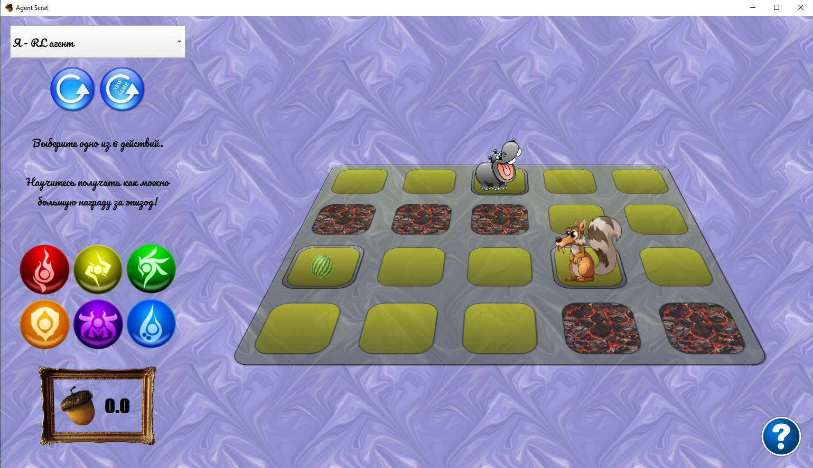
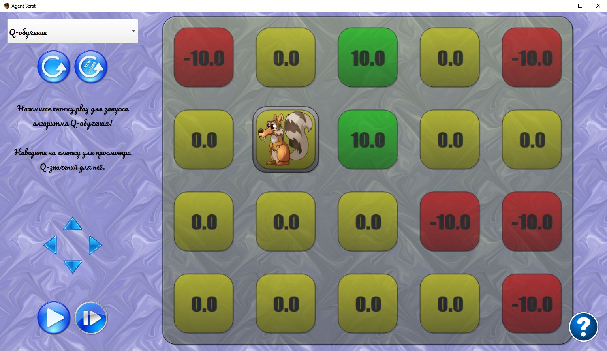
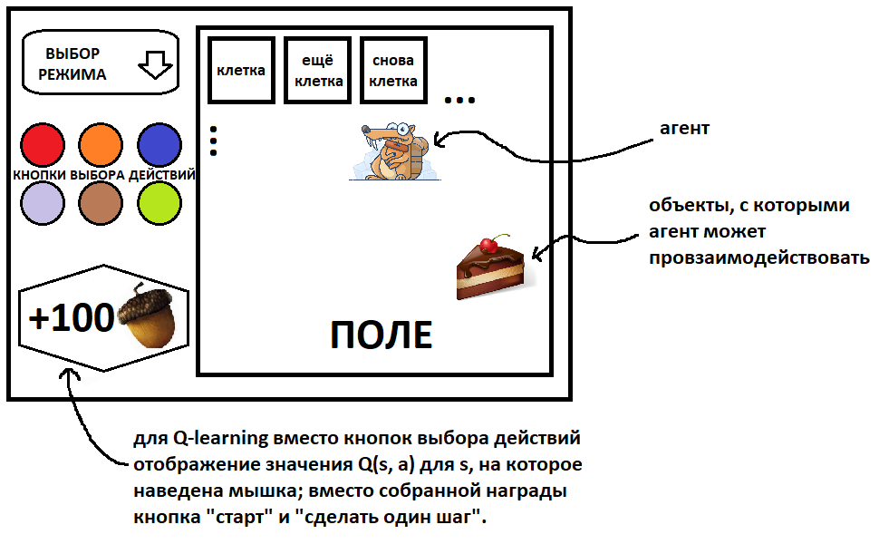

# MDP Visualizer

This is a semester project MDP Visualizer developed on the course ["Python3 collaborative application development"](http://uneex.ru/LecturesCMC/PythonDevelopment2020).

### A Brief Description

The application supports 2 modes:
- **I Am RL Agent** mode

    In this mode you are invited to try to feed the Hippo by pressing the action buttons on the left. Your current reward is shown in the lower-left corner of the screen. 
    
    

- **Automatic RL, Please** mode

    Here you may run the QLearning RL algorithm in step-by-step or continuous mode.
    
    

The modes can be switched in the combo box in the upper-left corner.

You can reset the game or start a new one by pressing big blue buttons in the upper-left corner in both modes. 

### The Problem:

Develop a program for visualization of [Markov Decision Processes (MDPs)](https://en.wikipedia.org/wiki/Markov_decision_process).

#### Key Tasks:
 
- Develop the animated interface for the agent's movement in state space of the MDP.
- Implement a possibility to specify the MDP manually.
- Implement the [Q-learning](https://en.wikipedia.org/wiki/Q-learning) algorithm for [reinforcement learning](https://en.wikipedia.org/wiki/Reinforcement_learning) and its visualization. 

### The Authors:

> Sergey Ivanov, 617 group (@FortsAndMills)

> Viktor Yanush, 617 group (@justanothercoder)

> Sergey Serov, 617 group (@sserov)

### Interface Design Plan:

### The Framework:

> PyQT 5

### How to Install and Run the Game

There are 2 possibilites of distribution after the cloning.

1. You may install the package with the command 
    
        python setup.py install
   in the project directory.
        
   To run the game execute the command
    
        python -m mdp_visualizer.game
   in the terminal.
        
2. You may run the command

        python -m mdp_visualizer.game
   **in the project directory** in the terminal.

### Localization

The application is now available with two localizations which are set corresponding to your system language.

### Testing

To run the tests use the command 

    python -m pytest
in the project directory.

### The Documentation
To build the docs run the command 
    
    make html
in `sphinx` folder.

The docs will appear in `sphinx/_build/html/index.html`.
