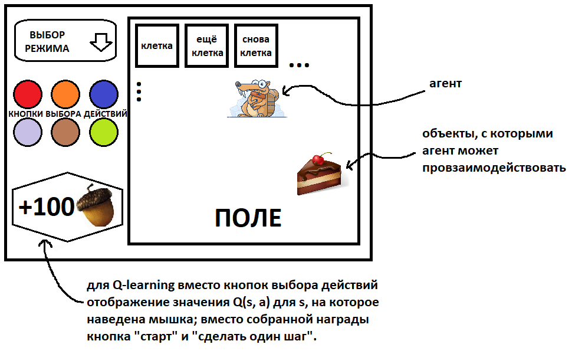

# MDP Visualizer

Семестровый проект MDP Visualizer по курсу "Совместная разработка приложений на Python3"

### Постановка задачи:

Создать программу для визуализации марковских процессов принятия решений ([MDP](https://en.wikipedia.org/wiki/Markov_decision_process)).
#### Основные подзадачи:
 
- Создать анимированный интерфейс для перемещения агента по MDP.
- Реализовать возможность задать MDP вручную (в перспективе --- не только на сетке).
- Реализовать алгоритмы [Value iteration](https://en.wikipedia.org/wiki/Markov_decision_process#Value_iteration) / [Policy iteration](https://en.wikipedia.org/wiki/Markov_decision_process#Policy_iteration) обучения с подкреплением ([RL](https://en.wikipedia.org/wiki/Reinforcement_learning)) и их визуализацию.
- Реализовать алгоритмы [Q-learning](https://en.wikipedia.org/wiki/Q-learning) и [SARSA](https://en.wikipedia.org/wiki/State%E2%80%93action%E2%80%93reward%E2%80%93state%E2%80%93action) и их визуализацию. 

### Авторы:

> [Иванов Сергей, группа 617](https://git.cs.msu.ru/s02180174)

> [Януш Виктор, группа 617](https://git.cs.msu.ru/s02180104)

> [Серов Сергей, группа 617](https://git.cs.msu.ru/s02140303)

### Проект интерфейса:

Базовая конструкция планирует выглядеть примерно так:

### Используемый фреймворк:

> PyQT 5

### Установка и запуск
Для установки в качестве пакета следует запустить `setup.py`
    
    python setup.py install
Чтобы запустить игру, достаточно выполнить команду

    python -m mdp_visualizer.game
Если установка не была произведена, то делать это нужно в директории проекта.

Для запуска тестов можно выполнить команду 

    python -m pytest
в директории проекта

### Документация
Для сборки документации необходимо выполнить команду 
    
    make html
в директории `sphinx`, после чего в `sphinx/_build/html/index.html` будет собрана документация по проекту.